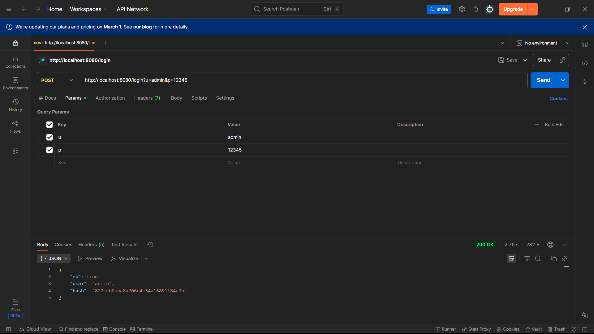
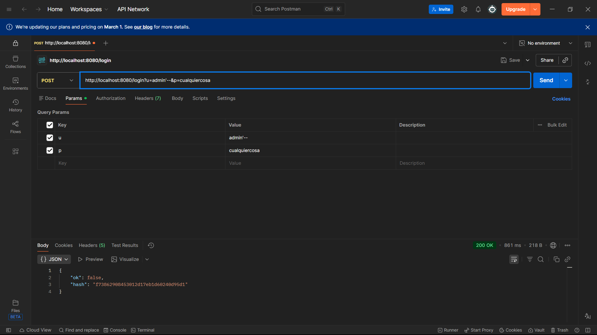
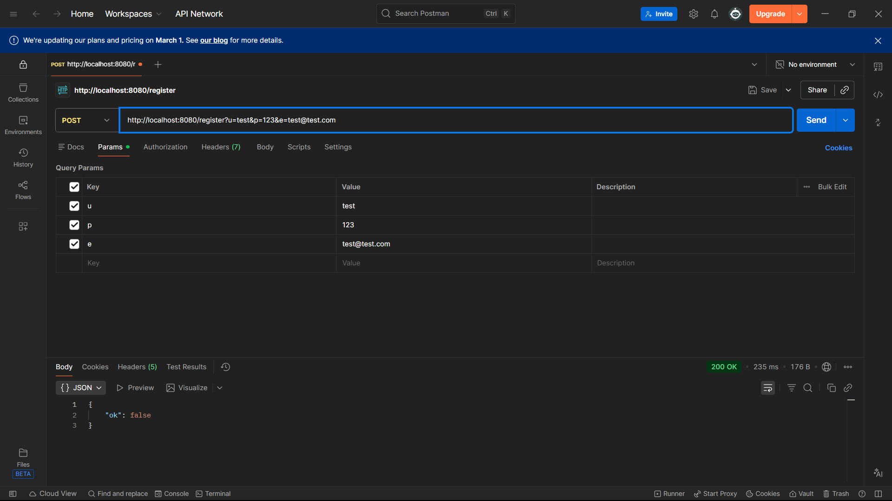
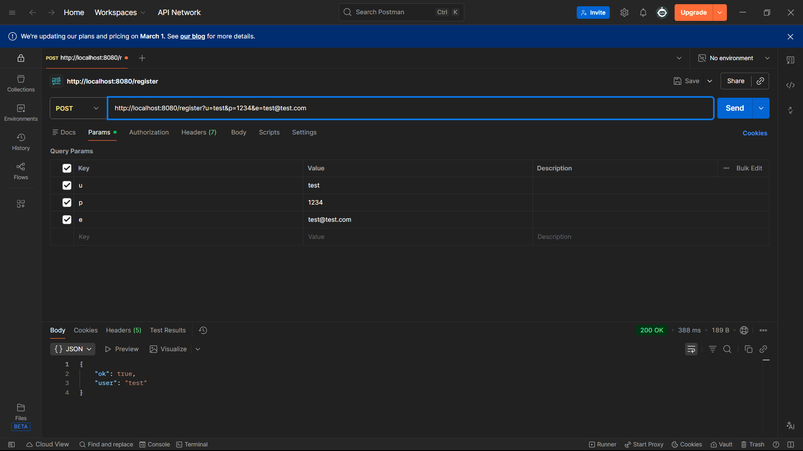

# Fase 2
| # | Descripción del problema | Archivo | Línea aprox. | Principio violado | Riesgo |
|---|---|---|---|---|---|
| 1 | **SQL Injection** - Concatenación directa de strings en queries sin PreparedStatement | UserRepository.java | L20, L32 | Seguridad Básica | **ALTO** |
| 2 | **MD5 para hashing de contraseñas** - Algoritmo débil, vulnerable a ataques de fuerza bruta | AuthService.java | L47 | Seguridad Básica | **ALTO** |
| 3 | **Exposición de datos sensibles** - El hash de contraseña se devuelve en la respuesta HTTP | AuthService.java | L20, L31 | Seguridad Básica | **ALTO** |
| 4 | **Credenciales hardcodeadas** - BD y contraseñas en el código fuente y docker-compose | UserRepository.java / docker-compose.yml | L13-14, docker-compose L9-10 | Seguridad Básica | **ALTO** |
| 5 | **Recursos no cerrados** - Connection y Statement no se cierran (memory leak) | UserRepository.java | L18-24, L29-33 | SOLID (SRP), Clean Code | **MEDIO** |
| 6 | **Nombres de variables extremadamente cortos** - `u`, `p`, `e`, `s`, `r`, `c`, `q`, `hp` sin claridad | AuthController.java y otros | L15, L22, L28, L34, etc. | Clean Code (Naming) | **MEDIO** |
| 7 | **Atributos públicos en entidad** - User tiene fields públicos sin encapsulación | User.java | L3-5 | Clean Code | **BAJO** |

# Fase 3
## Prueba 1 — Login válido

**1. ¿Qué datos sensibles aparecen?**  

    Devuelve hash de la contraseña ingresada (MD5 del password) en la respuesta, tanto si el login es correcto como si falla.
    También retorna el user (admin) cuando es correcto.

**2. ¿Debería retornarse eso?**  

    No. Un hash de contraseña nunca debería exponerse en una API (facilita ataques offline y filtración de credenciales derivadas).
    En un login, lo correcto es devolver un token/sesión y datos mínimos, no hashes.  

## Prueba 2 — SQL Injection

**1. ¿Qué ocurrió?**  

    La API respondió 200 OK pero procesó la entrada maliciosa (admin'--) y devolvió un hash en la respuesta. Aunque no se logró entrar al sistema, esto muestra que el backend arma el SQL con los parámetros del usuario.

**2. ¿Por qué es peligroso en producción?**  

    Porque permite intentar inyecciones SQL reales, filtra información sensible (hashes) y abre la puerta a accesos no autorizados. En producción, un payload más afinado podría explotar la falla.

## Prueba 3 — Registro con contraseña débil

  
**1. ¿Cuál fue rechazado?**

- *p=123* fue rechazado.
- *p=1234* fue aceptado y el usuario se creó.

**2. ¿Es una validación suficiente?**  

    No. Solo valida la longitud mínima, pero permite contraseñas muy fáciles de adivinar (como “1234”). Falta exigir complejidad básica (letras, números, símbolos) y usar un hash seguro para contraseñas.